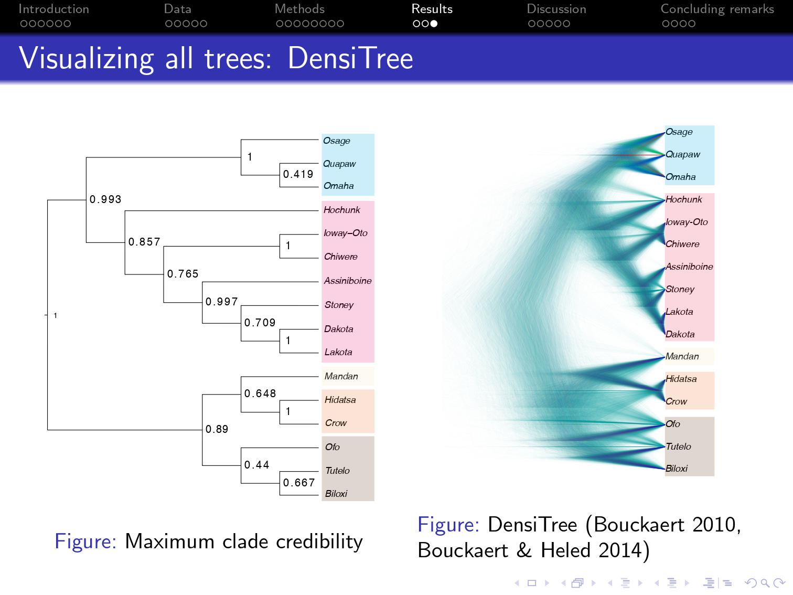

# Implementation 

## BEASTling

BEASTling [@maurits2017] is a suite of command line tools designed to help linguists generate XML files used for phylogenetic analysis. The program itself does not perform the analysis but instead helps linguists prepare the data in a much more friendly way. BEASTling is designed to be linguist-oriented; it takes in data with CSV formats and produces XML files, which are often lengthy and not easily interpretable. Linguists are able to specify model parameters by editing an configuration file in a straightforward and convenient way, without directly dealing with the BEAST interface. One great advantage of BEASTling lies in its integration with Glottolog. This function would require (1) the data is curated following the format described in the previous section; (2) the data contains an *iso* column specifying the three-letter ISO code for each language, which could be sourced from Glottolog. The addition of an *iso* column gives the program a *prior* that all languages contained in the data belong to a single family [@maurits2017]. BEASTling provides an official [tutorial](https://beastling.readthedocs.io/en/latest/tutorial.html) of analyzing the phylogeny of Indo-European languages with cognate sets. This tutorial uses typological traits to investigate the phylogeny of Siouan languages. 

## Phylogeny of Siouan

Siouan is a language family of North America; see the figure below for geograpgical information of selected Siouan languages. Edwin Ko presented a Bayesian phylogenetics analysis of 16 Siouan languages, implemented with BEAST 2 [@ko2021] (see slides [here](http://eddersko.com/assets/KoSCLC41Slides.pdf)). @ko2021 manually coded altogether 258 typological features. 

```{r, echo=FALSE, fig.cap="Map of selected Siouan languages (Ko, 2021).", out.width = '80%', fig.align='center'}
knitr::include_graphics("./images/siouan.png")
```

### Pre-processing
The CSV file Edwin shared contains **15** languages (without loway-Oto) and a total **248** features (access the file [here]("./data/typological_siouan-12_12_21.csv")). The original CSV is a wide table with every column corresponding to one feature and every row one language (see the table below).

|   Language  | Feature 1 | Feature 2 | Feature 3 | Feature 4 | ... |
|:-----------:|:---------:|:---------:|:---------:|:---------:| :-: | 
|     Crow    |     1     |     0     |     0     |     0     | ... |
|   Hidatsa   |     1     |     0     |     0     |     0     | ... |
|    Mandan   |     1     |     0     |     0     |     0     | ... |
|    Lakota   |     0     |     0     |     0     |     1     | ... |
|    Dakota   |     0     |     0     |     0     |     1     | ... |
| Assiniboine |     0     |     0     |     0     |     1     | ... |
|    Stoney   |     0     |     0     |     1     |     0     | ... |
|   Chiwere   |     0     |     0     |     0     |     1     | ... |  
|   Hochunk   |     0     |     0     |     0     |     1     | ... |
|    Osage    |     0     |     0     |     0     |     1     | ... |
|    Omaha    |     0     |     0     |     0     |     1     | ... |
|    Quapaw   |     0     |     0     |     0     |     1     | ... |
|    Tutelo   |     0     |     1     |     0     |     0     | ... |
|    Biloxi   |     1     |     0     |     0     |     0     | ... |
|     Ofo     |     0     |     0     |     1     |     0     | ... |

We first reshape the table and turn it into the expected data format. In the converted table below, we assign each feature an ID (see slide 43 through 48 for a list of features used in the original analysis^[Ideally, description of each feature is detailed in a separate file. It is not clear which 10 of the 258 features are removed from the list.]). We retrieve ISO code for each language through an R package [*lingtypology*](https://ropensci.github.io/lingtypology/index.html) [@moroz2017], which connects R with Glottolog (V.4.4)[@hammarstrom2014]. The .R file used to do data conversion can be accessed [here]("./data/siouan.R"). Lingtypology retrives data from an earlier version of Glottolog (the latest is v.4.5). ISO codes for *Hochunk*, *Omaha*, and *Chiwere*, which are not avilable in this earlier version, have to be manually added. It should be noted that the header or column names are not arbitrary. For BEAST to identify the language family, the header of ISO and language column must be *iso* and *language* respectively. Alternatively, we can also keep the ISO code in a separate file called *siouan_code.csv*. 

| iso |   language  | feature | value |
|:---:|:-----------:|:-------:|:-----:|
| cro |     Crow    |    1    |   1   |
| hid |   Hidatsa   |    1    |   1   |
| mhq |    Mandan   |    1    |   1   |
| lkt |    Lakota   |    1    |   0   |
| dak |    Dakota   |    1    |   0   |
| asb | Assiniboine |    1    |   0   |
| sto |    Stoney   |    1    |   0   |
| iow |   Chiwere   |    1    |   0   |
| win |   Hochunk   |    1    |   0   |
| osa |    Osage    |    1    |   0   |
| oma |    Omaha    |    1    |   0   |
| qua |    Quapaw   |    1    |   0   |
| tta |    Tutelo   |    1    |   0   |
| bll |    Biloxi   |    1    |   1   |
| ofo |     Ofo     |    1    |   0   |
| ... |     ...     |   ...   |  ...  |

To proceed, download the [data folder]("./data/") directly from the project repository and keep it under the *Downloads* directory of your computer. The data folder should contain:

1. The original data: *typological_siouan-12_12_21.csv*
2. The reshaped Siouan data with ISO: *siouan_converted_iso.csv*
3. The reshaped Siouan data without ISO: *siouan_converted.csv*
4. ISO code for each language: *siouan_code.csv*
5. The .R code used to do data conversion: *siouan_data.R*

### Installation 

#### Install BEAST 2 with Java

As previously mentioned, BEASTling interfaces with BEAST 2 through command lines. BEAST 2 can be installed at its [homepage](http://www.beast2.org/); multiple packages are available for installation, depending on operating systems. BEAST 2 requires Java to run; for the purpose of convenience, please install the BEAST 2 with Java.

```{r, echo=FALSE, fig.cap="BEAST 2 installation package.", out.width = '70%', fig.align='center'}
knitr::include_graphics("./images/java.png")
```

If you have downloaded BEAST 2 sucessfully, you should have a folder named BEAST 2.6.X in your *Applications* folder or any directory you specify. BEAST 2 is a suite of methods and tools. Within the BEAST 2.6.X folder, you should have:

1. LogCombiner
2. TreeAnnotator
3. DensiTree
4. BEAUti
5. AppLaucher

You can interact with all of these submodules with their GUIs (Graphical User Interfaces). Alternatively, we can call each module using command lines. In this tutorial, we aim to carry out phylogenetic analysis in command lines completely, without interacting with BEAST 2 directly.


#### Install Beastling

First, be sure to install Python! See [this blog post](https://phoenixnap.com/kb/check-python-version) to check if Python is installed properly on your operating system. BEASTling is written in Python and can be easily installed via *pip*, which installs and manages python packages. Pip is a built-in function if Python is downloaded from [python.org](https://www.python.org/). 

```{bash eval=FALSE}
# in terminal, check if python and pip are installed
python --version
python -m pip --version
``` 

If set up properly, BEASTling can be easily fetched by calling *pip install*; run the following line to check if BEASTling is successfully installed. 

```{bash eval=FALSE}
# install beastling using pip
pip install beastling

# check if beastling is installed
pip list | grep -F beastling
``` 

#### Command line basics
Let's inspect if data is in its expected format. We first need to set up the working directory, which is *Downloads*, where you keep the *data* folder previously downloaded from the project repository. In terminal, we use *mkdir* to create a directory and *cd* to navigate directories. The following six command line codes should be sufficient for the purpose of this tutorial.  

```{bash eval=FALSE}
# create a directory
mkdir NAME_OF_A_DIRECTORY

# go to a directory
cd PATH

# go to root directory
cd .

# move up a directory
cd ..

# switch to a previous directory
cd -

# list all files in the current directory
ls
```

We first go to the data folder; and inspect the first 10 lines of our data using the *head* command. 

```{bash eval=FALSE}
# go to our data folder; windows uses \ backslash
cd Downloads/data 

# take a look at the first 10 lines of our data
head -10 siouan_converted.csv

# your output should look like this: 
Language_ID,Feature_ID,Value
Crow,1,1
Hidatsa,1,1
Mandan,1,1
Lakota,1,0
Dakota,1,0
Assiniboine,1,0
Stoney,1,0
Chiwere,1,0
Hochunk,1,0
```

### Analysis

Only one step away from generating the XML file! We need a configuration file to specify parameters we would like to set up so that BEAST 2 can run the analysis based exactly on the configuration. You can use *any* text-editing program you would like to use to write the config file; be sure to add the .conf extension to the file. @ko2021's model specification can be divided into three parts:

1. substitution model
2. tree prior
3. clock model

We first run the analysis with a substitution model, then move on to a more sophisticated model with a tree prior and a clock model. 

```{r, echo=FALSE, fig.cap="BEAST 2 parameter setup (Ko, 2021).", out.width = '100%', fig.align='center'}

```
#### Understand the configuration file

A config file is divided into sections, each is labeled with a name enclosed in the square bracket. Some sections require names; some not. Under each section, we may assign a value to each parameter. 

```{bash eval=FALSE}
[section1 (name1)]
para1 = value1
para2 = value2
...

[section2 (name2)]
para1 = value1
para2 = value2
...

[section3 (name3)]
para1 = value1
para2 = value2
...
``` 
 
BEASTling supports parameter specification of 7 different sections. We do not have to specify each parameter for each section. Most of them have default values that we do not want to change. For the purpose of this tutorial, we tweak parameters included in the first five sections.  

1. admin section: interface with Glottlog and BEAST 2
2. MCMC section: MCMC-related model specification
3. languages section: language-related parameters and interface with geneological information from Glottolog 
4. model section: model selection 
5. clock section: calibrations of the model section
6. geography section: interface with geographical information from Glottolog 
7. geo_priors section: calibrations of the geography section

#### Write your configuration file 

A basic or minimal config file requires a model section only; others could be omitted. In the model section, we at least need to specify which model we would like to use and the path to the data. It should be noted that we *must* give our model a name. We select models depending on data types. In our case, typological traits are coded in the binary format. BEASTling supports two binary *substitution models*—Binary CTMC^[Continuous Time Markov Chain.] and Binary Covarion, both of them are widely used in the literature, e.g., @bouckaert2012, @hoffmann2021. @ko2021's analysis also includes these two models (see figure 3.3). 

The major difference between these two models lies in the transition between states (i.e., absence or presence of a trait). CTMC regulates a fixed rate of transition between states. A language, which might not have a trait (state 0), may evolve to develop this trait (state 1) at some time point, and vice verse. Rate of change is fixed for both directions [@hoffmann2021]. The covarion model, on the other hand, handles rate of change in a dynamic way, allowing variation in the rates of change [@hoffmann2021], which can either be fast or slow, parameterized by *f* in the figure below. See @jager2021 for an overview of binary models.

```{r, echo=FALSE, fig.cap="Overview of binary models (Hoffman et al. 2021, p.124) (Left: CTMC; Right: Covarion).", out.width = '70%', fig.align='center'}
knitr::include_graphics("./images/model.png")
```
It is not neccsarily true that covarion is absolutely better than CTMC; subgrouping is affected by other parameters as well. In fact, @ko2021's analysis shows that CTMC might fit the data better. We can start with a minimal model with CTMC as our model. Lastly, we specify the path to the data. Be sure to add the .conf extension to the file (i.e. siouan_ctmc_basic.conf) and place it under the data folder so that the config file and the data are under the same directory. 

In addition to model selection, we can specify *chainlength* in MCMC section. The default is ten million steps or iterations of MCMC, which would normally take at least half an hour to run. In our basic model, we first try 50000 steps. Lastly, we add an admin section, specifying that the output XML file should have the name *siouan_ctmc_basic*. Be sure to delete commented lines if you want to copy and paste the setting below. 

```{bash eval=FALSE}
# name the output as siouan_ctmc_basic.xml
[admin]
basename=siouan_ctmc_basic

# set the number of iterations to 50000
[MCMC]
chainlength = 50000

# select CTMC as our subsitution model; 
# provide a path to data
[model siouan_ctmc_basic]
model=binaryctmc
data=siouan_converted.csv
``` 

Now we are all set! Open your terminal and tell BEASTling to compile the XML file, which should be generated within a blink. 

```{bash eval=FALSE}
beastling siouan_ctmc_basic.conf
``` 

Let's call BEAST 2 to analyze the XML file! Make sure your BEAST 2 is properly installed. Check your *Applications* folder to see if a BEAST 2 folder exists. The folder should have a name BEAST 2.6.X, depending on the version of BEAST you have. The latest version BEAST 2.6.7 should be installed if you follow this tutorial. We call BEAST 2 in command lines by accessing the program contained in the folder^[You can also use BEAST 2 with multi-threading (2 threads or 4 threads), which should speed up the iteration process: /Applications/BEAST\ 2.6.7/bin/beast -threads 4 siouan_ctmc_basic.xml]. 

```{bash eval=FALSE}
/Applications/BEAST\ 2.6.7/bin/beast siouan_ctmc_basic.xml
```

BEAST 2 should be running now! In the output, you will see developers of BEAST 2, summary of the data, citation of the BEAST 2 program, and lastly posterior calculated from each sample. 

```{r, echo=FALSE, fig.cap="Log of posterior caculation.", out.width = '70%', fig.align='center'}
knitr::include_graphics("./images/log.png")
```

For this basic model, the iteration process lasts within 20 seconds. When completed, two files are generated:

1. *siouan_ctmc_basic.log*: a log file, keeping prior, likelihood, and posteriors calculated from each sample.
2. *siouan_ctmc_basic.nex*: a nexus file, containing results of the phylogenetic analysis that has been carried out by BEAST 2.

We can have a birds-eye view of subgrouping by calling *DensiTree* [@bouckaert2014], which overlays all trees together to give an overview of subgrouping. You can also select to view the consensus tree, which is a collection of representative trees. The figure below shows the consensus tree and all trees side by side. 

```{bash eval=FALSE}
/Applications/BEAST\ 2.6.7/bin/DensiTree siouan_ctmc_vanilla.nex
```

Congrats! We just generate our very first set of phylogenetic trees. There are a few mismatches between reported trees and ours. First, *Osage* and *Omaha* are grouped together. On closer inspection, you would find subgrouping of the first node is not absolutely conclusive. The node probability (0.419) reported in @ko2021 is not high (left); the DensiTree shown on the right side is also fuzzy. There are two major differences. First, somehow our model believes *Hochunk* and *Chiwere* belong to a different subgroup. Second, *Biloxi*, which should be a member of the Ohio Valley Siouan, separates its lineage with *Totelo* and *Ofo*. 

```{r, echo=FALSE, fig.cap="Phylogenetic trees of Siouan languages (left: consensus tree; right: all trees.).", out.width = '100%', fig.align='center'}
knitr::include_graphics("./images/siouan_ctmc_basic_tree.png")
```

```{r, echo=FALSE, fig.cap="Phylogenetic trees of Siouan languages (Ko, 2021).", out.width = '100%', fig.align='center'}

```

Apart from these basic settings, we could also continue to specify other parameters, not all are suitable for linguistic phylogenetic analysis though. We following @ko2021's analysis to include a *tree prior* and a *clock model*. Among available tree priors, the Yule model and the birth death model are more widely cited in linguistic research; others might be more robust in evolutionary biology [@hoffmann2021]. The major difference between these two models lies in if they assume language extinction. The Yule mode is a pure birth model; which assumes that the dataset contains all the languages in the family and does not allow extinct languages [@hoffmann2021]. The birth-death model, by definition, allows both extinct and extant languages [@hoffmann2021]. The dataset we have does contain extinct languages, most of them spoken in Mississippi Valley, including *Ofo*, *Biloxi*, and *Tutelo*. Some of them are nearly extinct, including *Mandan*, *Osage*, and *Omaha*. Ideally, a birth-death model should better capture the evolution process. In reality, we tend to try both models. @ko2021's best model indeed includes a birth-death model; the second best uses a Yule model. In addition to specifying tree priors, we can also tweak substitution model's (CTMC) rates of change, which could be sampled from a gamma distribution. If a gamma distribution is sliced into four categories^[Four is the default setting.], then we will have four different scaling factors. BEAST 2 would average probabilities calculated by applying each factor^[See BEAST 2's [documentation](https://taming-the-beast.org/tutorials/Prior-selection/) for more discussions on gamma distribution.]. Furthermore, we include a *clock model* to estimate the time depth or age of subgrouping [@hoffmann2021]. An evolutionary clock is either *strict* or *relaxed*. A strict clock assumes that substitution of states occurs at a fixed rate, which would be an average of all substitutions [@hoffmann2021]. A relaxed clock allows variation in the speed of evolution; some lineage may evolve faster than others [@hoffmann2021]. The *speed* of change is again sampled from a distribution, which could logarithmic or a gamma distribution. Here, we would set up a relaxed model, with the speed of change sampled from a log distribution, which is the default setting. Lastly, we increase *chainlength* or iterations to a reasonably sufficient number; a substantial increase would make the whole process tedious. @ko2021's analysis also includes a 25% burnin, which discards the initial 25% percent of the trees sampled. MCMC typically gets stuck in a low-probability region when searching for an optimal probability; this period of time is considered *burnin*. Our final config file should look like this:

```{bash eval=FALSE}
# name the output as siouan_ctmc.xml 
[admin]
basename=siouan_ctmc 

# increase the iterations to 5000000 steps
[MCMC]
chainlength = 5000000

# set the tree prior to birth-death model;
[languages]
tree_prior=birthdeath

# select CTMC as our subsitution model; 
# discard first 25% of iterations;
# provide a path to data;
# specify rates of change sampled from a gamma distribution
[model siouan_ctmc_model]
model=binaryctmc
log_burnin=25
data=siouan_converted.csv
gamma_categories=4

# include a relaxed clock model
[clock siouan_ctmc_clock]
type=relaxed
```
We then pass our config file to BEASTling to produce the XML file. BEAST 2 reads in the specification in XML file and generates phylogenetic analysis in a nexus file, which is processed by DensiTree for visualization. 

```{bash eval=FALSE}
beastling siouan_ctmc.conf

/Applications/BEAST\ 2.6.7/bin/beast siouan_ctmc.xml

/Applications/BEAST\ 2.6.7/bin/DensiTree siouan_ctmc.nex
``` 

```{r, echo=FALSE, fig.cap="Phylogenetic trees of Siouan languages (left: consensus tree; right: all trees.).", out.width = '100%', fig.align='center'}

```

It seems that our new model only slightly improves subgrouping while still mistakenly separates *Hochunk* and *Chiwere* from the rest of the members, and *Biloxi* from Mississippi Valley group. The subgrouping of the Mississippi Valley Siouan is not 100% certain in @ko2021's original analysis, partially because this subgroup has a substantial number of missing data. It should be noted that our data contains **248** out of **258** features used in the original analysis, which might partially accounts for the mismatch here. 

#### Play with BEAST 2 and other toolkits

In our analysis, ISO code does not really help much since all of our languages belong to the same family; they are monophyletic in nature. If we are dealing with languages from mixed families, specifying which clade some of the languages belong to should be an important prior. Phylogeography, which should be insightful to our analysis, is not working properly in BEASTling. The idea is to make use of the geographical information sourced from Glottolog. BEASTling is able to retrieve latitudes and altitudes from Glottolog (see the following lines, excerpted from the XML file generated by BEASTling) but BEAST 2 raises errors when processing the geographical information. 

```{r, echo=FALSE, fig.cap="Geographical information sourced from Glottolog.", out.width = '20%', fig.align='center'}
knitr::include_graphics("./images/siouan_geography.png")
```

You can further tweak parameters included in BEASTling and explore other modules of BEAST 2. Additionally, you can also interact with other toolkit available in the field of Bayesian phylogenetics. For instance, you can use [FigTree](http://tree.bio.ed.ac.uk/software/figtree/) to view clade probability or NeighborNet [@bryant2004] to inspect if the tree is sufficiently tree-like; some phylogenetic relations resemble more like networks. 

Have fun!